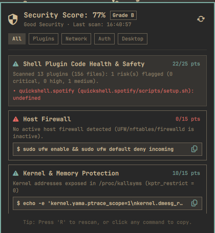

# OmaSecurity (`ucmz851.omasecurity`)

**OmaSecurity** is a lightweight, zero-bloat security posture auditor and deep plugin code health scanner designed specifically for the Omarchy Quattro desktop environment (`omarchy-shell` / Quickshell).

It provides continuous, glanceable security auditing on the status bar and expands into actionable recommendations with one-click copyable shell remediation commands.

---

<p align="center">
  
</p>

---

## Installation & Removal

### Installation
Install directly using the Omarchy plugin manager:

```bash
omarchy plugin add https://github.com/ucmz851/omasecurity.git --enable
```

### Removal
To disable and remove the plugin from your system:

```bash
omarchy plugin remove ucmz851.omasecurity
```

---

## Core Security Capabilities

### 1. Deep Shell Plugin Code & Safety Analysis
Scans all installed QML, JavaScript, Python, Shell, and TOML files in `~/.config/omarchy/plugins/`:
- **Dangerous Downloads & Execution:** Detects unverified web piping (`curl ... | sh` / `wget ... | bash`).
- **Dynamic & Obfuscated Code:** Detects `eval()`, `new Function()`, base64 decoding piped to shell, and in-memory byte execution.
- **Hardcoded Secrets & Tokens:** Detects unencrypted private keys (`RSA`, `OPENSSH`, `EC`), GitHub Personal Access Tokens (`ghp_`), and cloud provider keys (`AKIA...`).
- **Protected Path Snooping:** Flags scripts attempting to access `~/.ssh/id_*`, `~/.gnupg/`, `~/.local/share/keyrings/`, browser profile data, or `/etc/shadow`.
- **Privilege Escalation (sudo/pkexec):** Flags unneeded root invocations inside user plugins.
- **Pinpoint Reporting:** Displays exact plugin name, relative file path, line number, risk explanation, and code snippet.

### 2. Linux Kernel & Memory Protections (Sysctl)
- **YAMA ptrace scope:** Verifies process memory inspection protections (`kernel.yama.ptrace_scope >= 1`) to stop unauthorized memory dumping of browser tokens or password managers.
- **Kernel Log Restrictions:** Verifies `kernel.dmesg_restrict` to prevent unprivileged users from reading kernel debug logs.
- **Kernel Symbol Hiding:** Checks `kernel.kptr_restrict` to prevent kernel exploit address targeting.
- **Linux Security Modules:** Requires `yama` and `landlock` in `/sys/kernel/security/lsm`. A hardened kernel flavour and lockdown mode are reported in details. AppArmor is optional on Omarchy and is only scored when the package is installed.

### 3. Privilege Boundaries & Execution Integrity
- **Sudoers Audit:** Detects dangerous `NOPASSWD: ALL` misconfigurations.
- **PATH Integrity:** Audits `$PATH` to ensure no relative directories (`.`) or world-writable directories are present that could allow binary hijacking.

### 4. Host Firewall & Exposure
- **Firewall State:** Audits `ufw`, `nftables`, or `firewalld` active states.
- **Listening Ports:** Audits public listeners bound to `0.0.0.0` or `::` vs localhost (`127.0.0.1`).
- **SSH Hardening:** Verifies `PermitRootLogin` settings in `/etc/ssh/sshd_config`.

### 5. Authentication & Key Permissions
- **SSH Directory & Private Keys:** Enforces `700` on `~/.ssh` and `600` on private keys.
- **GnuPG Keyring:** Enforces `700` permissions on `~/.gnupg/`.
- **Session Locking:** Verifies automated idle screen lock timeouts in `hypridle.conf` and `shell.json`.

### 6. Agent Surface
Omarchy symlinks shipped skills into agent skill directories and `omarchy-agent` starts the default agent with approval prompts disabled. These checks inventory that unattended surface:
- **Skills inventory (`agent_skills`, slow lane):** Counts Omarchy-shipped, vendor-shipped, and third-party skills across Claude, Codex, Cursor, Pi, and related roots. Marketplace plugins are inventoried as individual entries. Script, instruction, and config files use different rule sets; README/CHANGELOG/LICENSE and `references/`/`examples/`/`docs/` are skipped. Flags symlinks that point outside `$HOME`/`/usr/share/omarchy`, broken links, auto-approve flags (`--yolo`, `--allow-all`, `--dangerously-skip-permissions`) next to an agent binary, pipe-to-shell, writes to `~/.ssh` / shell rc / Omarchy hooks / `/etc`, and `curl`/`wget` to HTTP or a bare IPv4 address. Prompt-injection phrasing in markdown is LOW with no score deduction. Score deducts at most 2 hits per severity (CRITICAL 6, HIGH 3, MEDIUM 1).
- **MCP, hooks, and permissions (`agent_mcp`):** Inventories MCP servers from Claude, Codex, Cursor, Gemini, OpenCode, and Copilot configs. Flags unpinned `npx`/`uvx`/`bunx`/`pipx run` stdio servers, credential-like env keys (key names only), non-https remote URLs, unrestricted `permissions.allow` Bash entries, and `enableAllProjectMcpServers`. Reports the default agent from `~/.config/omarchy/defaults/agent` and the auto-approve flag `omarchy-agent` launches it with.
### 6. Package supply chain
- **Repository trust:** Parses `/etc/pacman.conf` (and `/etc/pacman.d` SigLevel overrides) and flags network repos whose effective `SigLevel` contains `TrustAll`, `Never`, or package-level `Optional`. The Omarchy default is `Required DatabaseOptional`.
- **Keyrings:** Checks `archlinux-keyring` / `omarchy-keyring` versions and whether Omarchy signing key `40DFB630FF42BCFFB047046CF0134EE680CAC571` is in the pacman keyring.
- **Update recency:** Reads `/var/log/pacman.log` (no `pacman -Sy`) and recommends `omarchy update` when the last full upgrade is stale.
- **Inventory (slow lane):** One local `pacman -Sl` plus foreign (`pacman -Qmq`) counts; a large foreign set is called out because unsigned local builds widen the supply chain.
- **arch-audit (slow lane):** Optional CVE scan from the extra repo; missing tool or network failure is N/A, not a failed check.
### 6. Boot & Disk
- **UEFI Secure Boot:** Reads Secure Boot and Setup Mode from efivars (with a `bootctl status` fallback). Disabled Secure Boot or setup mode is a HIGH finding. There is no one-click enroll command; a bad key can brick firmware. See the [Arch wiki UEFI/Secure Boot](https://wiki.archlinux.org/title/Unified_Extensible_Firmware_Interface/Secure_Boot) page and [sbctl](https://github.com/Foxboron/sbctl).
- **Disk encryption:** Walks `lsblk` from `/` for LUKS, flags LUKS1, and treats unencrypted swap (except zram) as MEDIUM. Unencrypted root on a VM/container is still a fail, but LOW, because the host or hypervisor often already encrypts the disk. LUKS headers are not dumped (needs root); details include the exact `cryptsetup luksDump` command.
- **Boot chain:** Checks for a unified kernel image, ESP `fmask`/`umask` 0077, and kernel lockdown vs Secure Boot. Omarchy hardware uses limine, a UKI under `/boot/EFI/Linux/omarchy*.efi`, and a systemd initramfs with `sd-encrypt`. EFI-only checks are N/A on this ARM VM.
### Services
- **Network-facing exposure (slow lane):** Scores sshd, cups, docker, nginx, and similar daemons with `systemd-analyze security`. Units that every Arch system flags as UNSAFE (`udisks2`, `user@.service`) are ignored because they do not face the network.
- **OpenSSH config:** Effective `PasswordAuthentication`, `PermitRootLogin`, and `X11Forwarding` from `sshd_config` plus drop-ins (first occurrence wins).
- **User systemd units:** Flags `ExecStart` paths under `/tmp`, `/var/tmp`, `/dev/shm`, or `~/Downloads`.

---

## User Interface & Features

- **Glanceable Status Bar Widget:** Shield icon (`󰒃`) dynamically tints green, yellow, or urgent red based on security score.
- **Animated Rescan:** Spinning refresh button (``) provides immediate visual feedback.
- **Category Filter Tabs:** Tabs are derived from audit categories (`All` plus each distinct category). Unknown categories still get a tab.
- **Not-applicable checks:** Shown with a dim **N/A** badge and are excluded from the score.
- **One-Click Remediation:** Click any fix command box or press `Enter`/`Space` to copy the exact shell command to your clipboard.
- **Zero-Bloat Performance:** The fast lane completes in **<150ms** with no network. Slow checks run in the background 10s after load, then hourly.

---

## Controls & Keybindings

| Action | How to Trigger |
| :--- | :--- |
| **Open / Close Panel** | Left-click the shield icon on your top bar |
| **Immediate Rescan** | Middle-click the bar icon, click the `` refresh icon, or press `R` inside panel |
| **Navigate Issues** | `Up` / `Down` arrow keys |
| **Copy Fix Command** | `Enter` / `Space` on selected issue, or click the copy button |
| **Filter Categories** | Click category pills (`All`, `Plugins`, `System`, `Network`, `Auth`) |
| **Dismiss Panel** | `Escape` |

---

## Headless and CI usage

The panel runs `python3 scripts/audit.py` with no flags (fast lane + cached slow
results) and always gets exit code 0. For terminals and CI:

```bash
python3 scripts/audit.py --format text
python3 scripts/audit.py --list
python3 scripts/audit.py --only firewall,kernel_hardening --format text
python3 scripts/audit.py --skip plugins_deep
python3 scripts/audit.py --slow                  # run slow checks now and refresh the cache
python3 scripts/audit.py --no-cache              # do not read cached slow results
python3 scripts/audit.py --baseline previous.json --strict
```

| Flag | Effect |
| :--- | :--- |
| `--format json\|text` | JSON (default) or a score table plus one line per check |
| `--only ID[,ID]` | Run only these check ids |
| `--skip ID[,ID]` | Skip these check ids |
| `--list` | Print `id`, `category`, `lane`, `max_score` and exit |
| `--slow` | Run slow-lane checks, write `$XDG_CACHE_HOME/omasecurity`, then print |
| `--no-cache` | Ignore cached slow results (pending N/A unless `--slow`) |
| `--baseline PATH` | Fill `baselineDiff` with `regressed`, `improved`, `scoreDelta` |
| `--strict` | Exit `1` if an applicable check failed or a baseline id regressed; exit `2` if `errors` is non-empty |

Example `--format text` run:

```
OmaSecurity 2.0.0  score=82  grade=B  Good Security
host  14:02:11  checks=7  failed=1  n/a=2

PASS  plugins_deep         Plugin Health       fast   25/25  All 2 installed plugins...
FAIL  firewall             Network             fast    0/15  No active host firewall...
N/A   kernel_hardening     System Security     fast    0/15  Kernel sysctl, cmdline...
```

JSON schema (two lines): every document has `schemaVersion: 2`, `tool`, `version`,
`score`, `grade`, `audits[]`, `errors[]`, and `baselineDiff`. Each audit has
`id`, `passed`, `applicable`, `score`, `max_score`, `severity`, `details`, `lane`.

See [BASELINE.md](BASELINE.md) for scoring, N/A rules, and the check catalog.

---

## File Structure

```
omasecurity/
├── BarWidget.qml       # Bar widget icon, dynamic color tinting, and tooltip
├── Panel.qml           # Anchored flyout panel with score, category filters, and finding cards
├── manifest.json       # Omarchy Quattro plugin manifest (namespaced id: ucmz851.omasecurity)
├── LICENSE             # MIT License
├── README.md           # Documentation & instructions
├── BASELINE.md         # Score contract, lanes, exit codes, and check catalog
├── preview.png         # Marketplace preview thumbnail
├── screenshots/        # Additional UI screenshots
└── scripts/
    ├── audit.py        # Runner: CLI, scoring, JSON/text output
    ├── checks/         # Modular checks, result contract, slow-lane cache
    │   ├── __init__.py
    │   ├── registry.py
    │   ├── cache.py
    │   ├── static_scan.py
    │   ├── plugins.py
    │   ├── firewall.py
    │   ├── kernel.py
    │   ├── lsm.py      # yama/landlock LSM baseline and auditd
    │   ├── privileges.py
    │   ├── keys.py
    │   ├── desktop.py
    │   ├── network.py
    │   └── agents.py
    │   └── packages.py
    │   └── boot.py
    │   └── services.py # service exposure, sshd_config, user units
    └── tests/          # Unit tests (fake files / patched subprocess)
```

---

## License

MIT © [ucmz851](https://github.com/ucmz851)
